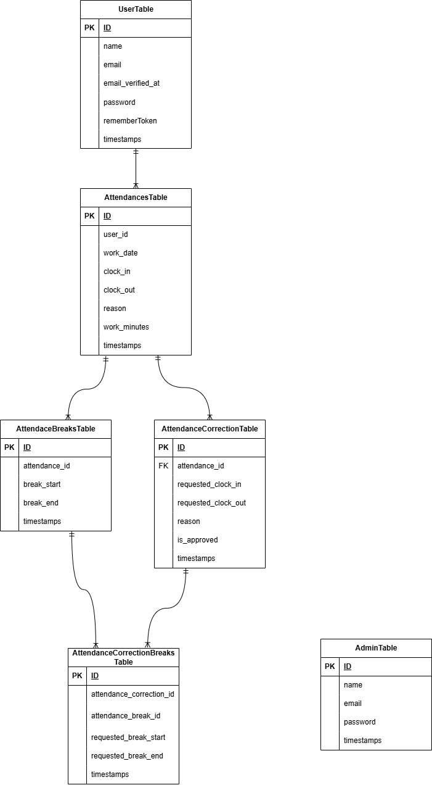

# アプリケーション名

勤怠管理アプリ

## 概要
Laravelを使用して制作した勤怠管理アプリです。  

一般ユーザーは出勤、退勤、休憩登録、勤怠修正申請を行うことができます。  

管理者は全ユーザーの勤怠情報確認、修正申請の承認、CSV出力を行うことができます。  

## 使用技術

- Laravel 8.83.27
- PHP 8.3.0
- MySQL 8.0.26
- Docker
- Laravel Fortify
- MailHog
- PHPUnit

## 環境構築

### Dockerビルド

1. git clone git@github.com:
2. DockerDesktopアプリを立ち上げる
3. 以下のコマンドを実行

```bash
docker-compose up -d --build
```

### Laravel環境構築

1. PHPコンテナへ移動

```bash
docker-compose exec php bash
```

2. Composerインストール

```bash
composer install
```

### データベース設定

.env.exampleを.envに変更。または.envファイルを新しく作成。  

.envに以下の環境変数を追加  

```env
DB_CONNECTION=mysql
DB_HOST=mysql
DB_PORT=3306
DB_DATABASE=laravel_db
DB_USERNAME=laravel_user
DB_PASSWORD=laravel_pass
```

### アプリケーションキーの作成

```bash
php artisan key:generate
```

### マイグレーション実行

```bash
php artisan migrate
```

### Seeder実行

```bash
php artisan db:seed
```

## URL

### アプリケーション

http://localhost/

### phpMyAdmin

http://localhost:8080

## メール認証設定

MailHogを使用してメール認証を確認します。

### MailHog確認画面

http://localhost:8025


## ER図



## 主な機能

### 一般ユーザー

- 会員登録
- メール認証
- ログイン
- 出勤登録
- 退勤登録
- 休憩開始・終了
- 勤怠一覧確認
- 勤怠詳細画面
- 勤怠修正申請

### 管理者

- 管理者ログイン
- 全ユーザーの勤怠一覧確認
- 日付別勤怠確認
- スタッフ一覧確認
- スタッフ別勤怠確認
- 勤怠情報修正
- 修正申請の確認・承認
- CSV出力

## テストアカウント

### 一般ユーザー

メールアドレス：staff1@example.com  
パスワード：password  

Factoryにより一般ユーザーのアカウントを10件作成したが、本アプリの動作確認は会員登録ユーザーで行っています。  

### 管理者ユーザー

メールアドレス：admin@example.com  
パスワード：password  

## テスト

PHPUnitを用いて以下のテストを実施

### テスト項目

- 会員登録機能
- ログイン機能
- 管理者ログイン機能
- メール認証機能
- 出勤機能
- 退勤機能
- 休憩開始・終了機能
- 勤怠一覧表示機能
- 勤怠詳細表示機能
- 勤怠修正申請機能
- 管理者による勤怠情報修正機能
- 管理者による修正申請承認機能
- スタッフ一覧表示機能
- スタッフ別勤怠一覧表示機能
- CSV出力機能

## 工夫した点

### 複数回の休憩登録に対応したデータ設計

休憩時間を勤怠情報とは別テーブルで管理し、  
一日の勤務に対して複数回の休憩を登録できるようにしました。  

AttendanceテーブルとAttendanceBreakテーブルをリレーションで紐づけることで、  
柔軟に休憩情報を管理できる設計にしました。  